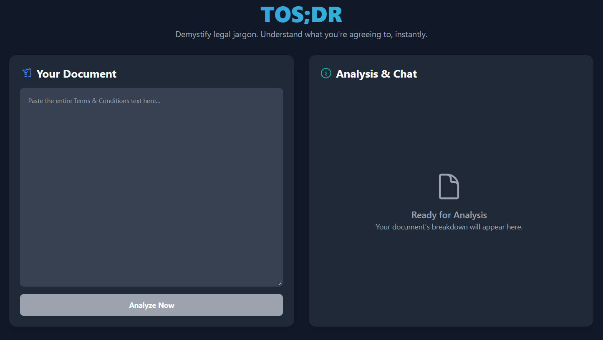
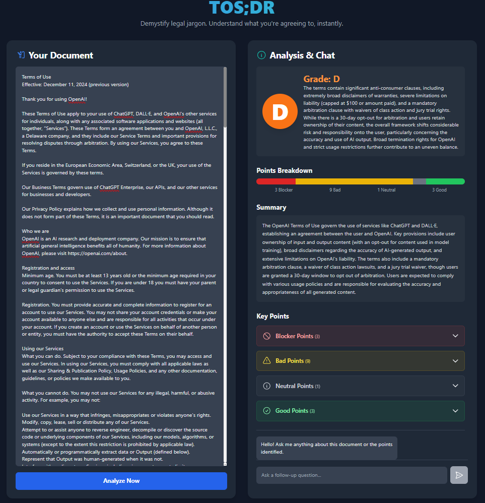
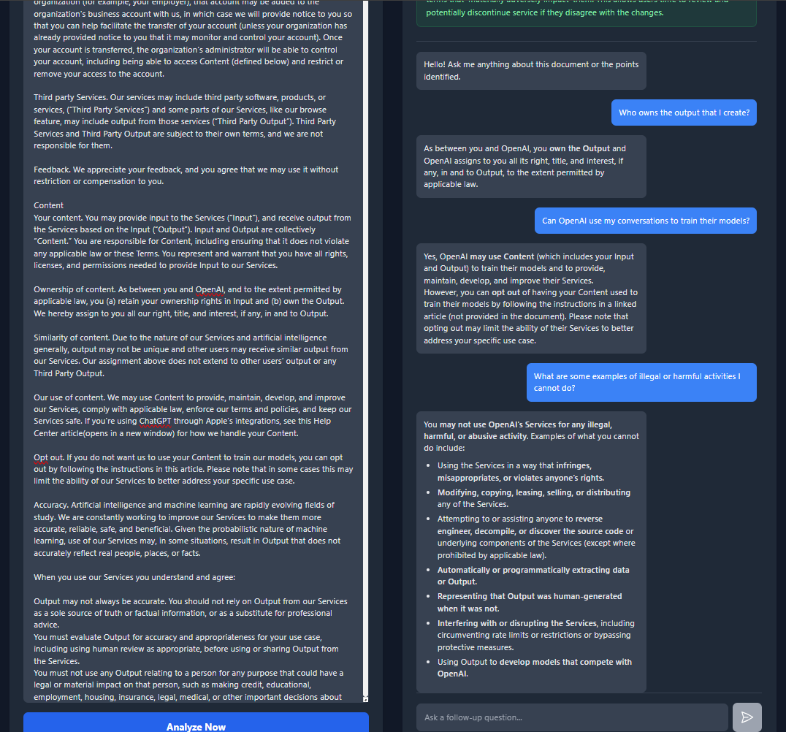

# TOS;DR (Terms of Service; Didn't Read)

An AI-powered app that instantly analyzes legal documents like Terms of Service and Privacy Policies to help you understand what you're really agreeing to. Built with the Google Gemini API.

---

## 🚀 Live Demo & Screenshots

TOS;DR provides a clean and simple interface to demystify complex legal jargon.

### 1. Simple & Clean UI
*Paste your document into a clear, uncluttered interface. Dark mode is included for comfortable reading.*


### 2. Instant Analysis
*Get an immediate, structured breakdown of the document, including a summary and color-coded sections for potential risks, data privacy clauses, and your obligations.*


### 3. Conversational Chatbot
*Ask follow-up questions in plain English to clarify any confusing points. The AI acts as your legal assistant, providing answers based strictly on the document's content.*


---

## ✨ Features

-   **📄 Instant Document Analysis:** Get a structured, easy-to-read breakdown in seconds.
-   **⚠️ Key Information Extraction:** Automatically summarizes the document and highlights crucial sections.
-   **💬 Conversational Q&A:** Ask follow-up questions to clarify confusing points.
-   **🌓 Dark Mode:** Features a sleek, user-friendly interface with a dark mode toggle.
-   **🚀 Lightweight Frontend:** Built with clean HTML, CSS, and vanilla JavaScript for a fast and responsive experience.

## 🛠️ Tech Stack

-   **AI Model:** Google Gemini 1.5 Flash
-   **Frontend:** HTML, Tailwind CSS, Vanilla JavaScript
-   **Backend:** Python, Flask

---

## 🚀 Getting Started

This project is designed to run directly in the browser from a single HTML file.

### Prerequisites

1.  **A Google Gemini API Key:** You can get one for free from **[Google AI Studio](https://aistudio.google.com/)**.
2.  **Enable the Vertex AI API:** After getting your key, you must enable the **Vertex AI API** in the Google Cloud project associated with your API key. You can do this by visiting the [API Library](https://console.cloud.google.com/apis/library), selecting your project, searching for "Vertex AI API", and clicking "Enable".

### Installation & Usage

1.  **Download the Code:**
    Clone this repository or download the `index.html` file.
    ```bash
    git clone https://github.com/shaunak-alt/TOS-DR
    cd TOS-DR
    ```

2. **Set Up the Backend**
    The backend server powers the AI analysis and chat.

    ```bash

    # Navigate to the backend directory
    cd backend
    
    # (Recommended) Create and activate a virtual environment
    python -m venv venv
    # On Windows
    venv\Scripts\activate
    # On macOS/Linux
    source venv/bin/activate
    
    # Install the required Python packages
    pip install -r requirements.txt
    
    # Create your environment file for the API Key
    # In the `backend` directory, create a new file named exactly .env
    # Open the .env file and add your Gemini API key like this:
    GEMINI_API_KEY="YOUR_GEMINI_API_KEY_HERE"
    ```
    
3. **Run the Application**
    You need to have the backend server running for the frontend to work.

    1. Start the Backend Server:
        In your terminal, from the backend directory, run:
    
        ```bash
        flask run
        ```
        The server will start on http://127.0.0.1:5000. Keep this terminal window open.

    2. Launch the Frontend:
        Navigate to the frontend directory and open the index.html file in your web browser.
